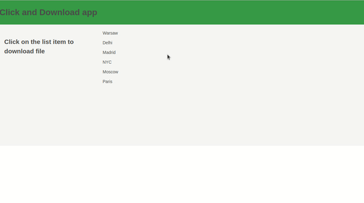

# Application that use https://react-spectrum.adobe.com/ ReactJS UI Library to create List 

## Functionalities

On the click of the list item , a .txt file will be downloaded with the name of the list item

### Example
- On click of the list item Warsaw a file name Warsaw.txt will be downloaded and content 'Warsaw' on it.

## UI Library

- React Spectrum : https://react-spectrum.adobe.com/react-spectrum/